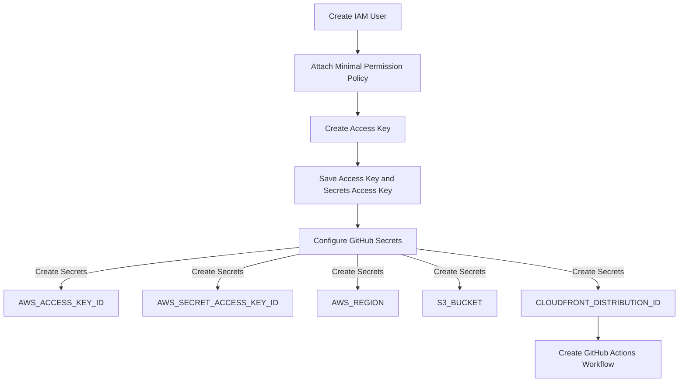

# Project Title

## CI/CD Process

Below is the flowchart for the CI/CD process used in this project:

```mermaid
graph TD;
    A[Create IAM User] --> B[Attach Minimal Permission Policy];
    B --> C[Create Access Key];
    C --> D[Save Access Key and Secrets Access Key];
    D --> E[Configure GitHub Secrets];
    E -->|Create Secrets| F[AWS_ACCESS_KEY_ID];
    E -->|Create Secrets| G[AWS_SECRET_ACCESS_KEY_ID];
    E -->|Create Secrets| H[AWS_REGION];
    E -->|Create Secrets| I[S3_BUCKET];
    E -->|Create Secrets| J[CLOUDFRONT_DISTRIBUTION_ID];
    J --> K[Create GitHub Actions Workflow];
```
